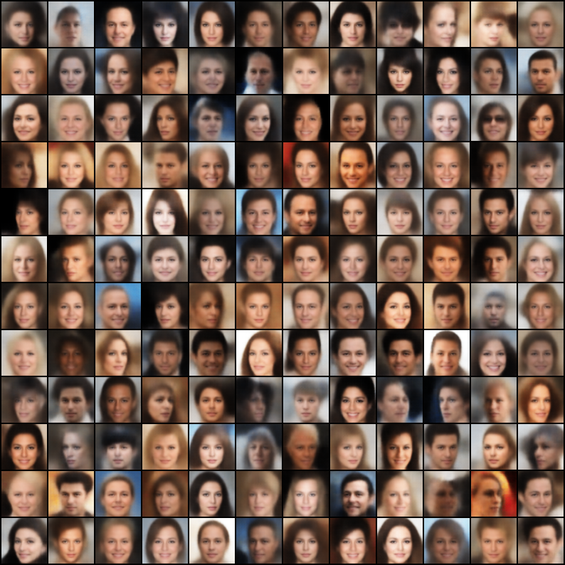
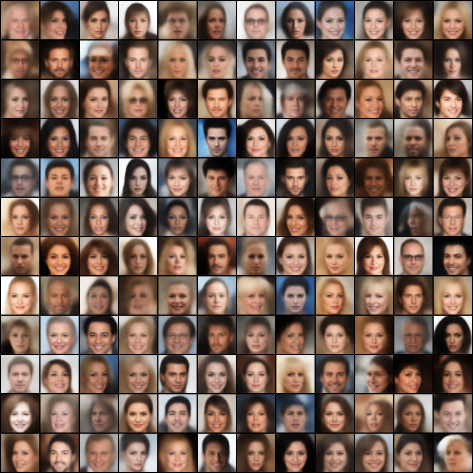
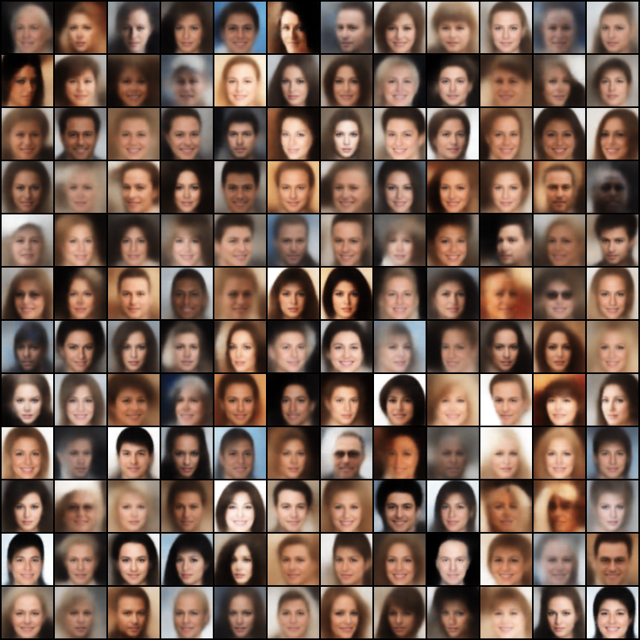

# VAE-pytorch

Personal Pytorch Implementations of Variational Auto-Encoders.

## To-do List

- [x] VAE
- [x] CVAE
- [x] Beta-VAE
- [x] Disentangled Beta-VAE
- [ ] Beta-TC-VAE
- [ ] DFC-VAE
- [ ] MSSIM-VAE
- [ ] Categorical VAE
- [ ] Joint VAE
- [ ] Info VAE
- [ ] LogCosh VAE
- [ ] VQ-VAE
- [ ] DIP-VAE

## Performance on CelebA Dataset

| Models | Generated Images |
| :-: |  :-: |
| VAE [Ref. 2] |  |
| CVAE [Ref. 3] |  |
| Beta-VAE [Ref. 4] |  |
| Disentangled Beta-VAE [Ref. 5] |  |
| Beta-TC-VAE [Ref. 6] | |

## References

1. Subramanian, A.K, PyTorch-VAE, GitHub repository, GitHub (2020), online available at [https://github.com/AntixK/PyTorch-VAE](https://github.com/AntixK/PyTorch-VAE).
2. Kingma, Diederik P., and Max Welling. "Auto-encoding variational bayes." arXiv preprint arXiv:1312.6114 (2013).
3. Sohn, Kihyuk, Honglak Lee, and Xinchen Yan. "Learning structured output representation using deep conditional generative models." Advances in neural information processing systems 28 (2015): 3483-3491.
4. Higgins, Irina, et al. "beta-vae: Learning basic visual concepts with a constrained variational framework." (2016).
5. Burgess, Christopher P., et al. "Understanding disentangling in $\beta $-VAE." arXiv preprint arXiv:1804.03599 (2018).
6. Chen, Ricky TQ, et al. "Isolating sources of disentanglement in variational autoencoders." arXiv preprint arXiv:1802.04942 (2018).
7. Hou, Xianxu, et al. "Deep feature consistent variational autoencoder." 2017 IEEE Winter Conference on Applications of Computer Vision (WACV). IEEE, 2017.
8. Snell, Jake, et al. "Learning to generate images with perceptual similarity metrics." 2017 IEEE International Conference on Image Processing (ICIP). IEEE, 2017.
9. Jang, Eric, Shixiang Gu, and Ben Poole. "Categorical reparameterization with gumbel-softmax." arXiv preprint arXiv:1611.01144 (2016).
10. Dupont, Emilien. "Learning disentangled joint continuous and discrete representations." arXiv preprint arXiv:1804.00104 (2018).
11. Zhao, Shengjia, Jiaming Song, and Stefano Ermon. "Infovae: Information maximizing variational autoencoders." arXiv preprint arXiv:1706.02262 (2017).
12. Chen, Pengfei, Guangyong Chen, and Shengyu Zhang. "Log hyperbolic cosine loss improves variational auto-encoder." (2018).
13. Oord, Aaron van den, Oriol Vinyals, and Koray Kavukcuoglu. "Neural discrete representation learning." arXiv preprint arXiv:1711.00937 (2017).
14. Kumar, Abhishek, Prasanna Sattigeri, and Avinash Balakrishnan. "Variational inference of disentangled latent concepts from unlabeled observations." arXiv preprint arXiv:1711.00848 (2017).
