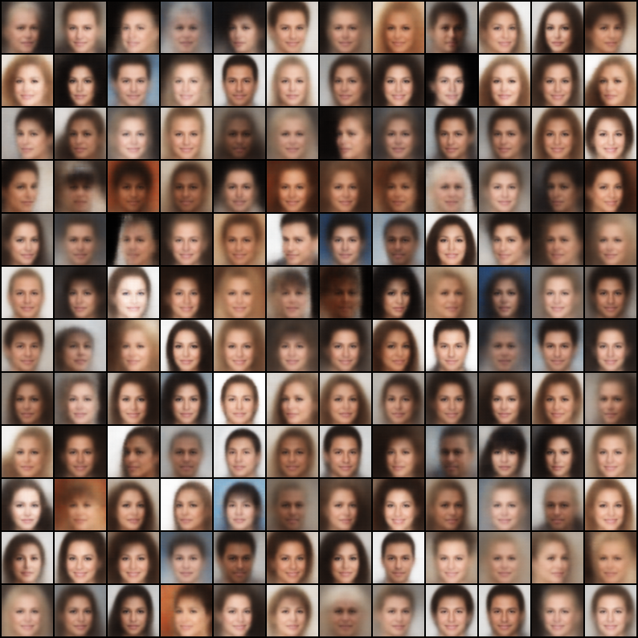
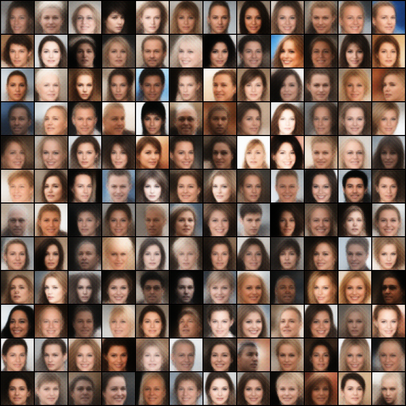
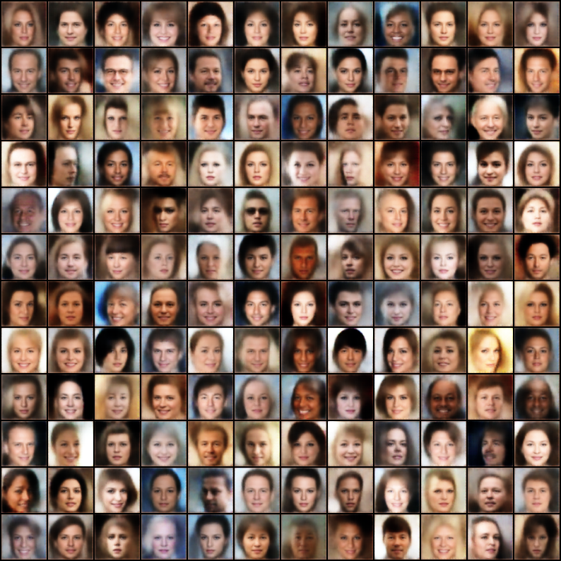

# VAE-pytorch

Personal Pytorch Implementations of Variational Auto-Encoders. This repository mainly contains the following VAEs.

- VAE
- CVAE
- Beta-VAE
- Disentangled Beta-VAE
- Beta-TC-VAE
- DFC-VAE
- MSSIM-VAE

## Run

### Training

To train the models, just execute the following command after setting the configurations correctly.

```bash
python run.py --cfg [Configuration File] --mode train
```

where `[Configuration File]` is the path to your configuration file, and `--mode train` can be omitted.

### Inference

For inference, just execute the following command after setting the configurations correctly.

```bash
python run.py --cfg [Configuration File] --mode inference
```

where `[Configuration File]` is the path to your configuration file, and there should be a checkpoint file in the corresponding path in `stats` folder.

## Configurations

The configuration file should be in `yaml` format. Specifically, the following fields can be specified in the configuration file.

- `model`, which describes the parameters of the model, including model name and other parameters.
- `dataset`, which describes the parameter of the dataset, including dataset type and other parameters.
- `optimizer`, which describes the parameter of the `AdamW` optimizer.
- `scheduler`, which describes the parameter of the `ExponentialLR` learning rate scheduler.
- `trainer`, which describes the parameters used in the training process, such as `max_epoch` and `multigpu`.
- `inference`, which describes the parameters used in inference stage, such as `sample_num`.
- `stats`, which describes the path to the statistics file, such as `stats_dir` and `stats_folder`. The checkpoint, reconstructed images and generated images should be stored in `stats_dir/stats_folder` directory.

You can see the given configuration files for more details.

## Performance on CelebA Dataset

The pretrained models and the generated images along with the reconstructed images are released on [Baidu Netdisk](https://pan.baidu.com/s/1X668uvUpQ1bFFHXj4j4Iew) (Extract code: lt4k).

| Models | Generated Images |
| :-: |  :-: |
| VAE ([Code](models/VAE.py), [Configs](configs/VAE-CelebA.yaml)) [2] |  |
| CVAE ([Code](models/CVAE.py), [Configs](configs/CVAE-CelebA.yaml)) [3] |  |
| Beta-VAE ([Code](models/BetaVAE.py), [Configs](configs/BetaVAE-CelebA.yaml)) [4] |  |
| Disentangled Beta-VAE ([Code](models/DisentangledBetaVAE.py), [Configs](configs/DisentangledBetaVAE-CelebA.yaml))  [Ref. 5] |  |
| Beta-TC-VAE ([Code](models/BetaTCVAE.py), [Configs](configs/BetaTCVAE-CelebA.yaml)) [6] |  |
| DFC-VAE ([Code](models/DFCVAE.py), [Configs](configs/DFCVAE-CelebA.yaml)) [7] |  |
| MSSIM-VAE ([Code](models/MSSIMVAE.py), [Configs](configs/MSSIMVAE-CelebA.yaml)) [8] |  |

## Performance on CUB200 Dataset

We also provide the CUB200 dataset configurations. But unfortunately, our VAEs performs badly on this generation task. Therefore, the performance is omitted here.

## Citations

```bibtex
@misc{fang2021vaepytorch,
  author =       {Hongjie Fang},
  title =        {VAE-pytorch},
  howpublished = {\url{https://github.com/Galaxies99/VAE-pytorch}},
  year =         {2021}
}
```

## References

1. Subramanian, A.K, PyTorch-VAE, GitHub repository, GitHub (2020), online available at [https://github.com/AntixK/PyTorch-VAE](https://github.com/AntixK/PyTorch-VAE).
2. Kingma, Diederik P., and Max Welling. "Auto-encoding variational bayes." arXiv preprint arXiv:1312.6114 (2013).
3. Sohn, Kihyuk, Honglak Lee, and Xinchen Yan. "Learning structured output representation using deep conditional generative models." Advances in neural information processing systems 28 (2015): 3483-3491.
4. Higgins, Irina, et al. "beta-vae: Learning basic visual concepts with a constrained variational framework." (2016).
5. Burgess, Christopher P., et al. "Understanding disentangling in $\beta $-VAE." arXiv preprint arXiv:1804.03599 (2018).
6. Chen, Ricky TQ, et al. "Isolating sources of disentanglement in variational autoencoders." arXiv preprint arXiv:1802.04942 (2018).
7. Hou, Xianxu, et al. "Deep feature consistent variational autoencoder." 2017 IEEE Winter Conference on Applications of Computer Vision (WACV). IEEE, 2017.
8. Snell, Jake, et al. "Learning to generate images with perceptual similarity metrics." 2017 IEEE International Conference on Image Processing (ICIP). IEEE, 2017.
